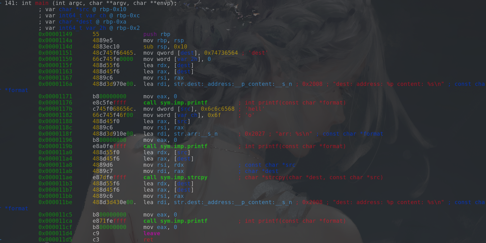

##  C数据类型
> 
> #### 基本类型
> ##### 数值类型
> 1. 整形
> * short
> * int
> * long
>
> 2. 浮点型
> * float
> * double
> 
> * 字符类型 char
> 
> #### 构造类型
> * 数组
> * 结构体    struct
> * 共用体    union
> * 枚举类型    enum
> 
> #### 指针类型
> 
> #### 空类型  void
> 
> #### 布尔型 bool
> * true    (1)
> * false   (0)
> 
> **浮点型在计算机内的存储形式**
> 例如当浮点型的长度为32位(从0开始到31),其最高位表示正负,低23位表示小数部分,中间8位表示整数部分
> 需要注意的是,浮点型变量是一个大概的值,计算机不太可能完全精确地表示出数学上的浮点数,所以当我们要判断一个浮点变量的值是否等于0,我们可以这么判断:
```c
#include <stdio.h>
#include <stdlib.h>
#include <stdbool.h>
#include <math.h>

bool judge_float(float f)
{
   if (fabs(f) <= 1e-6)
   {
        return true;
   }
   else
        return false;
}

int main()
{
    float x = 0.1;
    float y = 0.0000001;
    fprintf(stdout, "%f ~= 0 ?  %d\n", x, judge_float(x));
    fprintf(stdout, "%f ~= 0 ?  %d\n", y, judge_float(y));

    exit(0);
}
```

> **常量**
> > * 整型常量: 1, 2, 3...
> > * 实型常量: 3.14, 1.5, ...
> > * 字符常量: 由单引号引起来的一个字符或转义字符,如'a', 'X', '\n', '\t', ...
> > * 字符串常量: 由双引号引起来的一个或多个字符组成的序列,"a", "abcXY", "abc\n\021\018",""(空串), 字符串常量最后有一个转义字符'\0',即NULL字符, 来表示字符串的结束.尤其要注意的是,字符串常量放置在.rodata section中,所以不能对其修改,否则会segmentation fault.
> > * 标识符常量: #define BUFFSIZE 1024
> 
> 
> **变量**
> > 定义: [存储类型]  数据类型  标识符  =  值
> >       auto        int       a       =  1;
> >       register
> >       static
> >       extern
> > 
> > 可省略的存储类型分为:
> > * auto: 默认的选项,变量地址放在栈上.
> > * register: 放在寄存器中, 但只是建议性的,编译器不一定遵循,因为寄存器资源十分宝贵,必须满足苛刻的条件,编译器才会遵循.
> > * static(静态类型): 变量被放在.data section上, 即数据段上,数据段上存放的是初始化后的全局变量和局部静态变量(如static int a = 1;),如果static修饰的变量未初始化,自动初始化为0.
> > * extern(说明型, 上面3种都是定义型): 说明型,意味着不能改变被说明的变量的值或类型.
> ```c
> #include <stdio.h>
> #include <stdlib.h>
> 
> void func(void)
> {
>     static int x = 0;
>     x = x + 1;
>     fprintf(stdout; "static = %d\n"; x);
> }
> 
> int main()
> {
>     for(int i = 0; i < 3; i++)
>     {
>         func();
>     }
> 
>     exit(0);
> }
> ```
> 上面这段程序运行结果:
> ```
> static = 1
> static = 2
> static = 3
> ```
> ***static修饰的变量x,不论在哪里,一旦被定义过了,那么x就一直在被操作,它在内存中的地址也一直不变,因为它是在数据段中,不是在堆栈段.***

## 全局变量的缺点
来看这样一个程序:
```c
#include <stdio.h>
#include <stdlib.h>

int i = 0;

void func(void)
{
    for(int i = 0; i < 5; i++)
    {
        fprintf(stdout, "*");
        fprintf(stdout, "in %s, i = %d\n", __FUNCTION__, i);
    }
}
int main()
{
    for(i = 0; i < 5; i++)
    {
        func();
        fprintf(stdout, "in %s, i = %d\n", __FUNCTION__, i);
    }

    exit(0);
}
```

## 多文件编译
> #### main.c:
> ```c
> #include <stdio.h>
> #include <stdlib.h>
> #include "example.h"
> 
> //int i = 1;
> 
> int
> main()
> {
>     //fprintf(stdout, "[%s]: i = %d\n", __FUNCTION__, i);
>     fprintf(stdout, "hello from main\n");
>     func();
> 
>     exit(0);
> }
> ```
> #### example.c:
> ```c
> #include <stdio.h>
> #include <stdlib.h>
> 
> //int i = 1;
> 
> void
> func(void)
> {
>     //fprintf(stdout, "[%s]: i = %d\n", __FUNCTION__, i);
>     fprintf(stdout, "hello from example.c\n");
> 
>     exit(0);
> }
> ```
> #### example.h:
> ```c
> #ifndef EXAMPLE_H__
> #define EXAMPLE_H__
> 
> void func(void);
> 
> #endif
> ```
> #### gcc main.c example.c -E预处理之后结果比较长,就不放上来了,但是大概结构就是:
> ```c
> #include <stdio.h>
> #include <stdlib.h>
> 
> void func(void);
> 
> int
> main()
> {
>     fprintf(stdout, "hello from main\n");
>     func();
> 
>     exit(0);
> }
> 
> void func(void)
> {
> 
>     fprintf(stdout, "hello from example.c\n");
> 
>     exit(0);
> }
> ```
> ###### 可以看到,与我们把整个小项目一起写是一样的,出现头文件这个技术原因,大概是为了让分工合作更加方便.

## libc.a
> In most Linux OS, we can find it in **/usr/lib/libc.a**, it's a collection of *.o file(objective file, which has been compiled but **not** linked), we can see lots of objective files in it such as stdio.o etc.
> When we compile our c source file by gcc, we can use this option: **-static**. `gcc example.c -static` Then all objective file which is depended by example.c will be in ELF.

## 数组在汇编中的实现:
#### 先来看一段给数组中的元素赋值并打印到终端的C代码:
```c
//test.c
#include <stdio.h>
#include <stdlib.h>

int main()
{
    char arr[6];
    for (int i = 0; i < 6; i++)
    {
        arr[i] = i;
    }

    for (int i = 0; i < 6; i++)
    {
        printf("arr[%d] = %d\n", i, arr[i]);
    }
    exit(0);
}

```
#### 编译成test ELF文件
#### 这是`objdump -d test`反汇编的结果(只保留了main函数):

```assembly
test:     file format elf64-x86-64

0000000000001149 <main>:
    1149:	55                   	push   rbp
    114a:	48 89 e5             	mov    rbp,rsp
    114d:	48 83 ec 20          	sub    rsp,0x20
    1151:	64 48 8b 04 25 28 00 	mov    rax,QWORD PTR fs:0x28
    1158:	00 00 
    115a:	48 89 45 f8          	mov    QWORD PTR [rbp-0x8],rax
    115e:	31 c0                	xor    eax,eax
    1160:	c7 45 e8 00 00 00 00 	mov    DWORD PTR [rbp-0x18],0x0
    1167:	eb 12                	jmp    117b <main+0x32>
    1169:	8b 45 e8             	mov    eax,DWORD PTR [rbp-0x18]
    116c:	89 c2                	mov    edx,eax
    116e:	8b 45 e8             	mov    eax,DWORD PTR [rbp-0x18]
    1171:	48 98                	cdqe   
    1173:	88 54 05 f2          	mov    BYTE PTR [rbp+rax*1-0xe],dl
    1177:	83 45 e8 01          	add    DWORD PTR [rbp-0x18],0x1
    117b:	83 7d e8 05          	cmp    DWORD PTR [rbp-0x18],0x5
    117f:	7e e8                	jle    1169 <main+0x20>
    1181:	c7 45 ec 00 00 00 00 	mov    DWORD PTR [rbp-0x14],0x0
    1188:	eb 27                	jmp    11b1 <main+0x68>
    118a:	8b 45 ec             	mov    eax,DWORD PTR [rbp-0x14]
    118d:	48 98                	cdqe   
    118f:	0f b6 44 05 f2       	movzx  eax,BYTE PTR [rbp+rax*1-0xe]
    1194:	0f be d0             	movsx  edx,al
    1197:	8b 45 ec             	mov    eax,DWORD PTR [rbp-0x14]
    119a:	89 c6                	mov    esi,eax
    119c:	48 8d 3d 61 0e 00 00 	lea    rdi,[rip+0xe61]        # 2004 <_IO_stdin_used+0x4>
    11a3:	b8 00 00 00 00       	mov    eax,0x0
    11a8:	e8 83 fe ff ff       	call   1030 <printf@plt>
    11ad:	83 45 ec 01          	add    DWORD PTR [rbp-0x14],0x1
    11b1:	83 7d ec 05          	cmp    DWORD PTR [rbp-0x14],0x5
    11b5:	7e d3                	jle    118a <main+0x41>
    11b7:	bf 00 00 00 00       	mov    edi,0x0
    11bc:	e8 7f fe ff ff       	call   1040 <exit@plt>
    11c1:	66 2e 0f 1f 84 00 00 	cs nop WORD PTR [rax+rax*1+0x0]
    11c8:	00 00 00 
    11cb:	0f 1f 44 00 00       	nop    DWORD PTR [rax+rax*1+0x0]
    ```

赋值操作是从1160: `mov DWORD PTR [rbp-0x18],0x0`开始,[rbp-0x18]是赋值语句中的i, jmp到117b,判断i是否 <= 5, 若 <= 5则跳回1169继续赋值.
注意1173`mov BYTE PTR [rbp+rax*1-0xe],dl`,dl中的值是从edx中截断的,而edx又是从eax中得到的,eax的值正是[rbp-0x18]的值,即i的值.
传递顺序是这样的:**i = DWORD PTR [rbp-0x18] -> eax -> edx(dl) -> BYTE PTR [rbp+rax*1-0xe]**.
*这里`[rbp+rax*1-0xe]`就是数组每个元素的地址,每次赋值后rax的值加一,以此实现了下一次赋值就是下一个数组中元素的地址.*
**`[rbp-0xe]`就是该数组的首地址(此时rax=0).**
*由此看来数组和普通的局部变量差不多,只是多了一个rax\*x(x = 1, 2, 4, 8,...),简化了寻址方式.*
可以推断,如果这是一个int型的数组,那`rax*`1会变成`rax*4`

## 宏
来看这样一个程序:
```c
//test.c
#include <stdio.h>

#define __DEBUG__ 0

int main()
{
#if __DEBUG__
    printf("IN DEBUG!\n");
#endif
    printf("hello world!\n");
    return 0;
}
```
`gcc test.c -E`:
(只保留了main函数预处理后的内容)
```c
# 4 "test.c"
int main()
{


    printf("hello world!\n");
    return 0;
}
```

当源码中`#define __DEBUG__ 0`变成`#define __DEBUG__ 1`,再进行预处理:
```c

# 4 "test.c"
int main()
{

    printf("IN DEBUG!\n");

    printf("hello world!\n");
    return 0;
}
```
可以神奇地发现被`#if DEBUG`和`#endif`包含的内容出现在了预处理后的文件中
这表明在预处理时,宏就被处理掉了.

## string
字符串如果是在声明数组时出现,那这一个字符串的内容是可以被改变的.
如下程序声明并初始化char dest[10]数组,
```c
#include <stdio.h>
#include <stdlib.h>
#include <string.h>

int
main()
{
    char dest[10] = "dest";
    printf("dest: address: %p content: %s\n", dest, dest);
    char arr[6] = "hello";
    printf("arr: %s\n", arr);
    strcpy(dest,arr);
    printf("dest: address: %p content: %s\n", dest, dest);
    return 0;
}
```
反汇编这一段main函数:

可以看到定义数组时,字符串并非是在.rodata中的常量,而是直接由ascii码表示的.x86是little-ending,所以0x74736564表示的是"tsed",在实际的内存上倒过来,从内存低地址到高地址变成"dest".


